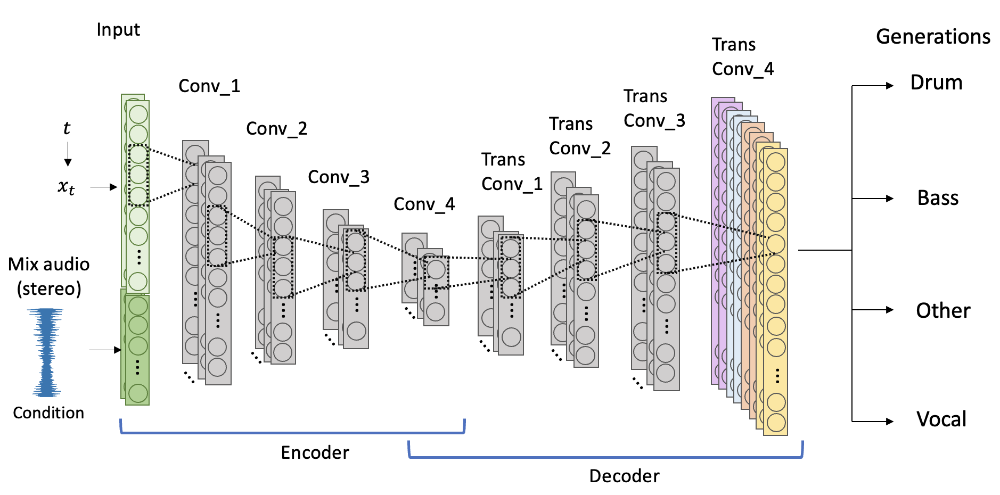

# AudioSepDiff: Novel Audio Source Separation Framework using Diffusion Model
This repository contains the code and dataset for our novel source separation framework.



## Installation
`pip install -r requirements.txt`

## Reproducing results
```
python test.py checkpoint_path='./diffusion.ckpt'
```

## Training Models

Training logs and checkpoints are saved inside `outputs`

### Diffusion model

```
python train.py model=TConv128Diff
```

### Encoder-Decoder model
```
python train.py model=TConv128
```

### Unet model
```
python train.py model=UNet
```

### Multi-modal loss

```
python train.py model=TConv128Spec
```

# Model Comparison

The following table compares different models on L2 loss, SDR metrics, and parameter sizes.  

| Model       | L2 loss | Drum   | Bass   | Other  | Vocal   | Avg SDR | Params |
|-------------|---------|--------|--------|--------|---------|---------|--------|
| **Conv**    | 0.151   | 0.067  | **0.547**  | -0.346 | -24.734 | -6.101  | 121K   |
| **TransConv** | 0.169   | -0.436 | -3.527 | 1.023  | -5.992  | -2.234  | 121K   |
| **Multimodal** | 0.517   | -5.182 | -7.329 | -3.263 | -12.082 | -6.962  | 121K   |
| **UNet**    | 0.170   | -0.863 | -3.683 | 0.444  | -6.568  | -2.668  | 186K   |
| **Diffusion** | **0.095**   | **1.460**  | 0.090  | **2.013**  | -5.944  | **-0.593**  | 123K   |

- **Bold** indicates the best performance in each column.  

